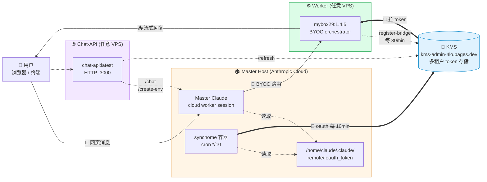
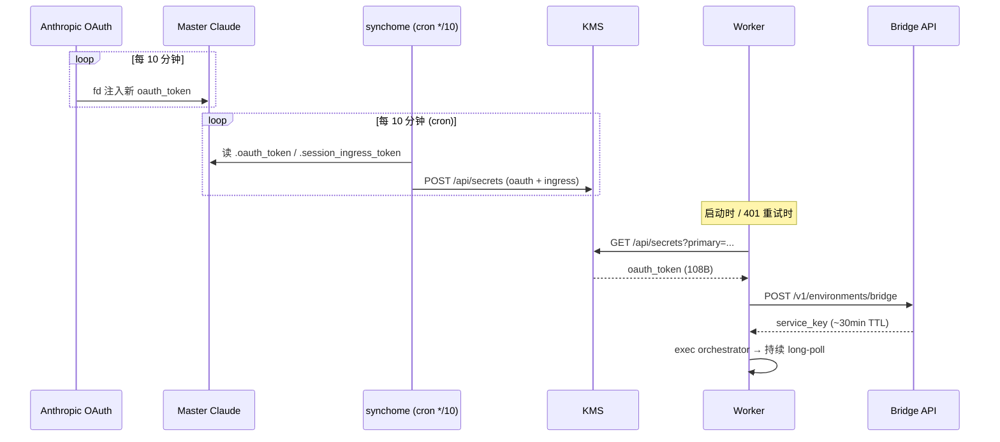
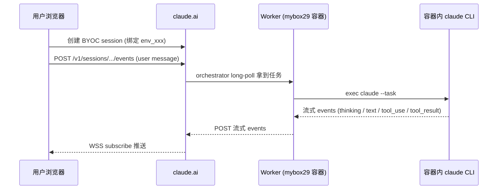

# mybox29

> Self-hosted runner for **Claude Code on the Web** — 让 claude.ai 网页发的消息路由到你自己的容器处理。

[](https://hub.docker.com/r/9527cheri/mybox29)
[](LICENSE)

---

## 它是什么

镜像里包含 Anthropic 内部的 `environment-runner orchestrator` 二进制（已 patch 让外部可用），加上完整多语言开发沙盒（Python 3.11 / Node 22 / Go 1.24 / Java 21 / Ruby 3.3 / Rust 1.94 / Bun 1.3）和 `@anthropic-ai/claude-code` v2.1.123。

容器作为 BYOC (Bring Your Own Compute) worker 注册到 Anthropic 控制平面后，**从 claude.ai 网页发起的、绑定你这个 environment 的 session 会被路由到该容器**，由容器内 claude 进程处理并把回复流回浏览器。

---

## 整体架构



**三种角色**：

| 角色 | 镜像 | 部署在 | 职责 |
|---|---|---|---|
| 🏠 Master | `9527cheri/sync-home:latest` | Anthropic 云端 master session | 持续刷 OAuth, cron 同步到 KMS |
| ⚙️ Worker | `9527cheri/mybox29:1.4.5` | 你的 VPS | 拉 KMS token, register-bridge, 处理网页消息 |
| 🌐 Chat-API | `9527cheri/chat-api:latest` | 你的 VPS（可选） | HTTP API 化 BYOC 协议, 任何语言可调 |

**关键发现（实测）**：claude.ai BYOC events API 仅需 `sessionKey` 一个 cookie，CF 不挑战 POST/GET。整个系统不依赖任何 cf_clearance / 浏览器 / playwright。

### Token 链路



### 消息路由（claude.ai 网页 → 你的 worker）



---

## 准备环境变量

```bash
git clone https://github.com/ziren28/mybox29.git && cd mybox29
cp .env.example .env       # 改 KMS_API_KEY / SECRET_NAME / SESSION_KEY
```

`.env` 是所有部署方式的**唯一秘密源**——docker / CLI / 脚本都从这一个文件读。

---

## 部署只需两条 docker 命令

### Step 1：Master Host 启动 synchome（一次性）

在你已经登录的 claude.ai session 里粘一条命令让它执行：

```bash
docker run -d --name synchome --restart unless-stopped \
  -e KMS_API_KEY='<你的KMS密码>' \
  -e SECRET_NAME='<给这台 master 起个名, 一般用 session_id 后段>' \
  -v /home:/home \
  9527cheri/sync-home:latest
```

它每 10 分钟自动同步 `/home/claude/.claude/remote/.oauth_token` 到 KMS。详见 [synchome 项目](https://github.com/ziren28/synchome)。

### Step 2：Worker 启动（任意机器）

下面三种**完全等价**，挑一个用：

```bash
# (A) 全部走 .env 文件 (推荐)
docker run -d --name mybox29-worker --restart unless-stopped \
  --env-file .env 9527cheri/mybox29:1.4.0

# (B) 老式 inline -e (不需要 .env)
docker run -d --name mybox29-worker --restart unless-stopped \
  -e KMS_API_KEY=KMS-KEY \
  -e SECRET_NAME=011UNUTAMv2SxCdhDM4cZfp9 \
  9527cheri/mybox29:1.4.0

# (C) 混合: .env 打底 + 临时覆盖某项
docker run -d --name mybox29-worker --restart unless-stopped \
  --env-file .env \
  -e WORKER_TAKEOVER=1 \
  9527cheri/mybox29:1.4.0
```

容器内 entrypoint 自动：
1. 从 KMS 拉 oauth（synchome 写入的）+ ingress
2. 双写到 `/home/claude/.claude/remote/.oauth_token` / `.session_ingress_token`
3. POST `/v1/environments/bridge` 拿 service_key
4. exec orchestrator 进入 BYOC 模式
5. 持续 long-poll claude.ai，处理网页发来的消息

完。两条命令完整自治。

---

## 跟 worker 直接对话（无浏览器）

`chat-final.mjs` 自动读同目录 `.env`，所以填好后直接跑：

```bash
bun chat-final.mjs "你好, 请简述运行环境"
```

走纯 BYOC events API，仅需 `sessionKey`，渲染 thinking / text / tool_use / tool_result 四种内容块。

---

## chat-api：HTTP 服务版本

把 BYOC 能力暴露成 HTTP API（4 个端点），任何语言都能调。

```bash
docker run -d --name chat-api --restart unless-stopped \
  -p 3000:3000 --env-file .env \
  9527cheri/chat-api:latest

# 跑在 Anthropic 网络 / TLS 拦截代理环境内时, 加一行挂载宿主 CA:
#   -v /etc/ssl/certs:/etc/ssl/certs:ro
```

### 端点速查

| 方法 | 路径 | 用途 |
|---|---|---|
| GET | `/health` | 健康检查 + 默认值 |
| POST | `/chat` | 发消息（自动建 session 或用已有 `session_id`） |
| POST | `/create-env` | 创建 `anthropic_cloud` environment |
| POST | `/refresh` | 从 KMS 拉 fresh oauth + ingress |
| POST | `/events` | 低层 events POST/GET 透传 |

### 请求示例

#### 1. 创建一个新 environment

```bash
curl -X POST http://localhost:3000/create-env \
  -H "content-type: application/json" \
  -d '{
    "cookie": "sk-ant-sid02-...",
    "name": "my-workspace",
    "languages": [
      { "name": "python", "version": "3.11" },
      { "name": "node",   "version": "20"   }
    ]
  }'
# → {"environment_id":"env_xxxxxxxxxxxxxxxxxxxxxxxx","raw":{...}}
```

#### 2. 发消息（自动建 session）

```bash
curl -X POST http://localhost:3000/chat \
  -H "content-type: application/json" \
  -d '{
    "cookie": "sessionKey=sk-ant-sid02-...; anthropic-device-id=...; lastActiveOrg=...",
    "environment_id": "env_xxxxxxxxxxxxxxxxxxxxxxxx",
    "title": "untitle",
    "model": "claude-sonnet-4-6",
    "thinking": true,
    "allowed_tools": ["Bash", "Read", "Write", "WebFetch", "WebSearch"],
    "append_system_prompt": "你是临时测试助手, 简短回报结果",
    "prompt": "uname -a && whoami",
    "timeout_ms": 60000
  }'
# → {"session_id","secret_name","reply","thinking","tool_uses","duration_ms","completed","view_url"}
```

#### 3. 发消息（复用已有 session）

```bash
curl -X POST http://localhost:3000/chat \
  -H "content-type: application/json" \
  -d '{
    "cookie": "sk-ant-sid02-...",
    "session_id": "session_xxxxxxxxxxxxxxxxxxxxxxxx",
    "prompt": "继续刚才的任务",
    "thinking": false
  }'
```

#### 4. 拉 KMS token

```bash
curl -X POST http://localhost:3000/refresh \
  -H "content-type: application/json" \
  -d '{
    "kms_api_key": "KMS-KEY",
    "secret_name": "011UNUTAMv2SxCdhDM4cZfp9"
  }'
# → {"primary","oauth_token","ingress_token","updated_at","time"}
```

#### 5. 低层透传 events

```bash
# GET 拉历史事件
curl -X POST http://localhost:3000/events \
  -H "content-type: application/json" \
  -d '{
    "cookie": "sk-ant-sid02-...",
    "session_id": "session_xxx",
    "action": "get",
    "sort_order": "desc",
    "limit": 50
  }'

# POST 自定义 event 列表
curl -X POST http://localhost:3000/events \
  -H "content-type: application/json" \
  -d '{
    "cookie": "sk-ant-sid02-...",
    "session_id": "session_xxx",
    "action": "post",
    "events": [{...}]
  }'
```

### /chat 完整字段

| 字段 | 类型 | 默认 | 说明 |
|---|---|---|---|
| `cookie` | string | `.env` SESSION_KEY | sessionKey 单值 或 浏览器整段 cookie 串 |
| `prompt` | string | _(必填)_ | 用户消息文本 |
| `session_id` | string | _(自动建)_ | 复用现有 session_xxx |
| `environment_id` | string | `.env` BRIDGE_ENV_ID | 自动建 session 时必需 |
| `model` | string | `claude-sonnet-4-6` | 仅新建 session 生效 |
| `thinking` | bool | `true` | 启用 thinking budget 8192 |
| `append_system_prompt` | string | _(空)_ | 注入 system prompt |
| `allowed_tools` | array | _(全开)_ | 工具白名单 |
| `title` | string | 时间戳 | 仅新建 session 生效 |
| `org_id` | string | `.env` ORG_ID | organization UUID |
| `client_sha` | string | _(从 cookie 自动抽)_ | `anthropic-client-sha` 头 |
| `full_beta` | bool | `true` | 用完整 magic beta header 集 |
| `timeout_ms` | int | 120000 | 轮询超时 |

支持 prompt 里 `{{session_id}}` / `{{secret_name}}` 占位符（server 创建 session 后回填）。

一键端到端 demo 见 [`e2e-demo.sh`](e2e-demo.sh)。

---

## 镜像 tag 体系

| Tag | 用途 |
|---|---|
| `9527cheri/mybox29:1.4.0` ⭐ | Worker 自治模式（KMS + register-bridge 内建） |
| `9527cheri/mybox29:byoc` | 1.4.0 别名 |
| `9527cheri/mybox29:1.3.1` | Worker 手动模式（要求外部传 ENVIRONMENT_SERVICE_KEY） |
| `9527cheri/mybox29:1.2.0` | 通用 + entrypoint（无 binary patch） |
| `9527cheri/mybox29:1.1.0` / `:env` | 仅 `claude --print` 独立调用 |
| `9527cheri/chat-api:latest` ⭐ | **HTTP API 服务**（Bun + alpine, 110MB） |
| `9527cheri/sync-home:latest` | **Master 端** token 自动同步到 KMS |

---

## 镜像内置环境

| 类目 | 版本 |
|---|---|
| OS | Ubuntu 24.04 |
| Languages | Python 3.11 · Node 22 · Go 1.24 · Java 21 · Ruby 3.3 · Rust 1.94 · Bun 1.3 |
| Build | Maven 3.9 · Gradle 8.14 · Make · CMake · Conan |
| DB tools | PostgreSQL 16 · Redis 7 · SQLite 3 |
| Container | Docker CE 29.3.1（CLI + buildx + compose） |
| Browser | Playwright 1.56 + Chromium 1194 |
| npm 全局 | typescript · prettier · eslint · pnpm · yarn · ts-node · nodemon · serve |
| Anthropic | `@anthropic-ai/claude-code` v2.1.123 + `environment-manager` (semver-patched) |

---

## 文件清单

```
.
├── README.md              本文件
├── LICENSE                MIT
├── .env.example           ★ 所有环境变量都在这里
├── .gitignore
│
├── Dockerfile             sanitization + entrypoint + binary patch
├── entrypoint.sh          ★ KMS 自治模式 + 独立调用 + worker 三合一入口
│
├── chat-final.mjs         ★ 纯 CLI 跟 worker 对话 (auto-load .env)
├── chat-api.mjs           ★ HTTP API 服务 (4 端点)
├── chat-api/Dockerfile    chat-api 镜像构建文件
├── e2e-demo.sh            一键端到端验证 (创 env → 建 session → 跑 synchome → KMS)
└── run-worker-final.sh    高级用法: 外部编排 + watchdog (auto-load .env)
```

---

## Token 链（全自动）

| 层 | 名称 | 寿命 | 谁更新 |
|---|---|---|---|
| L0 | `KMS_API_KEY` | 永久 | 你（一次性） |
| L1 | `oauth-token` | ~10 min | **synchome cron** 每 10 分钟同步 |
| L2 | `service-key` | 30 min+ | Worker 内部 register-bridge |
| L3 | `session_ingress_token` | session 内 | BYOC 协议管理 |

只要 master host 的 synchome 容器还在跑，token 永不过期。

---

## 故障排查

| 现象 | 原因 | 处理 |
|---|---|---|
| Worker 持续 401/403 | service_key 过期 | watchdog 自动重新 register-bridge（拉新 oauth） |
| KMS 里 token 时间戳不更新 | synchome 容器挂了 | 在 master 重启 `docker restart synchome` |
| Master cookie 失效 | sessionKey 过期（90 天 TTL） | 浏览器 F12 重新导出，更新 `.env` 里的 `SESSION_KEY` |
| `register-bridge 403 (scope)` | OAuth 不在 master-host 范围 | 确保 `SECRET_NAME` 对应 master host 的 oauth |
| `Environment runner version not valid semver` | 用了原版 binary | 用 `:1.4.0` 或更新镜像（内置 patched） |
| Worker 不接收 session | 默认 `WORKER_TAKEOVER=0` 不抢 | 临时设 `WORKER_TAKEOVER=1` 验证（验证完关掉） |

---

## 核心实现要点（实战发现）

| 发现 | 详情 |
|---|---|
| `cf_clearance` 不需要 | claude.ai BYOC events API 仅 `sessionKey` 一个 cookie 即可 POST/GET |
| events POST 必须 `session_` 前缀 | `cse_xxx` 被服务端拒绝 |
| 关键 beta header | `ccr-byoc-2025-07-29` + `environments-2025-11-01` |
| Bridge 注册响应 | `environment_id` / `organization_uuid` / `environment_secret` |
| Binary version patch | `release-b5ac58d65-ext` → `2.1.123-b5ac58d65-ext`（21B 等长替换） |
| 浏览器无 OAuth | claude.ai 前端用 cookie auth；OAuth 由 Anthropic 后端 fd 注入 cloud worker |
| BYOC 双向通信 | POST `/v1/sessions/{id}/events` 写消息；GET 同路径轮询读 |
| **Worker 路由竞争靠 `worker_epoch`** | 多 worker 注册同一 env 时，`worker_epoch` 大者获派 session |

---

## Bridge 注册请求 schema（反编译捡到）

`POST /v1/environments/bridge` 的 body 字段（Anthropic 未公开文档化，二进制 strings 提取）：

| 字段 | 类型 | 默认 / 推荐 | 作用 |
|---|---|---|---|
| `environment_id` | string | `env_xxx` | 必填，要绑定的 BYOC environment |
| `machine_name` | string | hostname | worker 主机名 |
| `directory` | string | `/workspace` | 工作目录 |
| `branches` | array | `["main"]` | ⚠️ 复数+数组（不是单数 `branch`） |
| `max_sessions` | int | 1 | 单 worker 最大并发 session |
| `metadata` | object | `{worker_type:...}` | 自定义元数据 |
| **`worker_id`** | string | hostname | worker 唯一标识 |
| **`worker_epoch`** ⭐ | int | `$(date +%s)` | **注册 epoch，越大越新；后注册的 worker 抢走 session 派发** |
| **`priority`** | int | 1000 | 综合优先级，越大越优先 |
| `costPriority` | int | _(可选)_ | 成本敏感度（越低越省） |
| `speedPriority` | int | _(可选)_ | 速度敏感度（越高越快） |
| `intelligencePriority` | int | _(可选)_ | 智能敏感度（越高越用大模型） |
| `capabilities` | array | _(可选)_ | 能力声明 |
| `protocolVersion` | string | _(可选)_ | 协议版本 |
| `environment_sub_type` | string | _(可选)_ | environment 子类 |

**默认不抢**（priority=0, epoch=0）—— **关键设计**：master cloud worker 必须保持高优先级以持续获 session，Anthropic 才会自动续 OAuth；如果 worker 抢走全部 session，master 闲置被回收，OAuth 不再刷新，整个 token 链断掉。

控制旋钮（按需启用）：

| 环境变量 | 作用 | 等价效果 |
|---|---|---|
| `WORKER_TAKEOVER=1` | 一键开抢 | epoch=`date +%s`, priority=99999 |
| `WORKER_PRIORITY=N` | 自定义 priority | epoch=0, priority=N |
| `WORKER_EPOCH=N` | 自定义 epoch | priority=0, epoch=N |

```bash
# 默认 (不抢, 仅作 fallback worker)
docker run -d --name mybox29-worker --restart unless-stopped \
  -e KMS_API_KEY=KMS-KEY \
  -e SECRET_NAME=011UNUTAMv2SxCdhDM4cZfp9 \
  9527cheri/mybox29:1.4.0

# 想接管 (临时验证 routing 是否打通)
docker run ... -e WORKER_TAKEOVER=1 9527cheri/mybox29:1.4.0
```

---

## License

MIT
