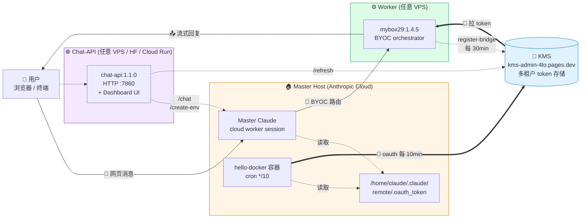
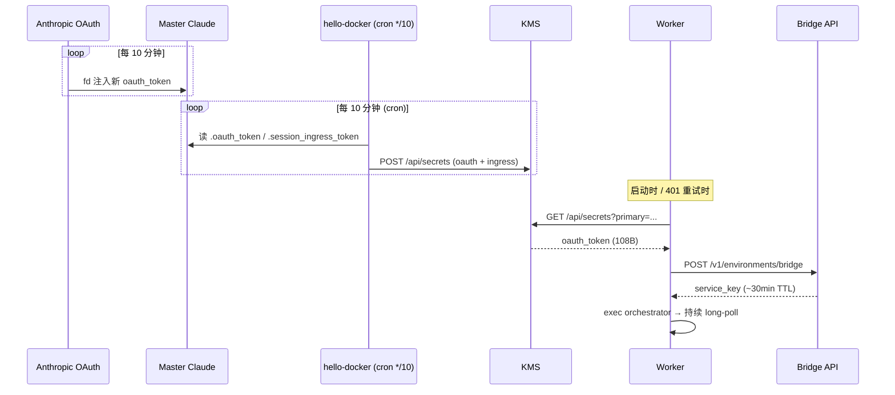
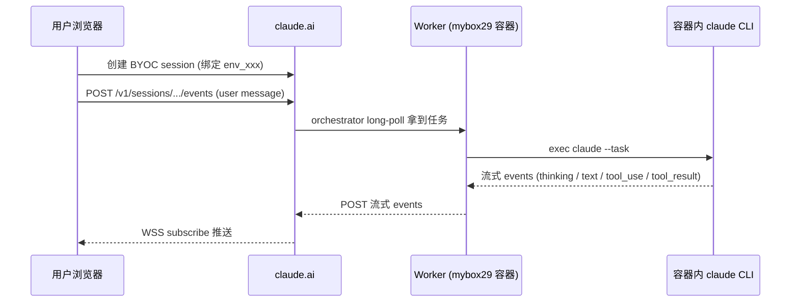

# mybox29

> Self-hosted runner for **Claude Code on the Web** — 让 claude.ai 网页发的消息路由到你自己的容器处理。

[](https://hub.docker.com/r/9527cheri/mybox29)
[](LICENSE)

---

## 它是什么

镜像里包含 Anthropic 内部的 `environment-runner orchestrator` 二进制（已 patch 让外部可用），加上完整多语言开发沙盒（Python 3.11 / Node 22 / Go 1.24 / Java 21 / Ruby 3.3 / Rust 1.94 / Bun 1.3）和 `@anthropic-ai/claude-code` v2.1.123。

容器作为 BYOC (Bring Your Own Compute) worker 注册到 Anthropic 控制平面后，**从 claude.ai 网页发起的、绑定你这个 environment 的 session 会被路由到该容器**，由容器内 claude 进程处理并把回复流回浏览器。

---

## 整体架构



**三种角色**：

| 角色 | 镜像 | 部署在 | 职责 |
|---|---|---|---|
| 🏠 Master | `9527cheri/hello-docker:1.0` | Anthropic 云端 master session | 持续刷 OAuth，cron 同步到 KMS |
| ⚙️ Worker | `9527cheri/mybox29:1.4.5` | 你的 VPS | 拉 KMS token，register-bridge，处理网页消息 |
| 🌐 Chat-API | `9527cheri/chat-api:1.1.0` | VPS / HuggingFace / Cloud Run | HTTP API + Web Dashboard，无状态 |

**关键发现（实测）**：claude.ai BYOC events API 仅需 `sessionKey` 一个 cookie，CF 不挑战 POST/GET。整个系统不依赖任何 cf_clearance / 浏览器 / playwright。

### Token 链路



### 消息路由（claude.ai 网页 → 你的 worker）



---

## 准备环境变量

```bash
git clone https://github.com/ziren28/mybox29.git && cd mybox29
cp .env.example .env       # 改 KMS_API_KEY / SECRET_NAME
```

`.env` 是 Worker 部署的**唯一秘密源**。chat-api 是无状态服务，**不持有用户凭证**，cookie 由调用方每次请求传入。

---

## 部署只需两条 docker 命令

### Step 1：Master Host 启动 token 同步（一次性）

在你已经登录的 claude.ai session 里粘贴执行：

```bash
docker run -d --name hello-docker \
  -e KMS_API_KEY='<你的KMS密码>' \
  -e SECRET_NAME='<给这台 master 起个名>' \
  -v /home:/home \
  -v /etc/ssl/certs:/etc/ssl/certs:ro \
  9527cheri/hello-docker:1.0
```

每 10 分钟自动将 `/home/claude/.claude/remote/.oauth_token` 同步到 KMS。源码：[helloDocker](https://github.com/ziren28/helloDocker)。

> 也可以用 [sync-home](https://github.com/ziren28/synchome)：`9527cheri/sync-home:latest`，功能相同。

### Step 2：Worker 启动（任意机器）

```bash
# (A) 全部走 .env 文件 (推荐)
docker run -d --name mybox29-worker --restart unless-stopped \
  --env-file .env 9527cheri/mybox29:1.4.5

# (B) inline 参数
docker run -d --name mybox29-worker --restart unless-stopped \
  -e KMS_API_KEY=<KMS密码> \
  -e SECRET_NAME=011UNUTAMv2SxCdhDM4cZfp9 \
  9527cheri/mybox29:1.4.5

# (C) 临时接管（验证 routing 是否打通）
docker run -d --name mybox29-worker --restart unless-stopped \
  --env-file .env -e WORKER_TAKEOVER=1 \
  9527cheri/mybox29:1.4.5
```

容器内 entrypoint 自动：从 KMS 拉 oauth + ingress → 双写 remote token 文件 → register-bridge 拿 service_key → exec orchestrator 进入 BYOC 模式 → 持续 long-poll 处理网页消息。

---

## chat-api：HTTP 服务 + Web Dashboard

把 BYOC 能力暴露成 HTTP API，同时内嵌一个密码保护的管理界面。

### 启动

```bash
# 本地
docker run -d --name chat-api --restart unless-stopped \
  -p 7860:7860 \
  -e ADMIN_PASSWORD=Aa112211 \
  9527cheri/chat-api:1.1.0

# TLS 拦截代理环境（云端容器内）额外挂载 CA
docker run -d --name chat-api --restart unless-stopped \
  -p 7860:7860 \
  -e ADMIN_PASSWORD=Aa112211 \
  -v /etc/ssl/certs:/etc/ssl/certs:ro \
  9527cheri/chat-api:1.1.0
```

### 部署到 HuggingFace Spaces

```yaml
# Space README.md frontmatter
sdk: docker
app_port: 7860
```

默认端口 **7860** 与 HuggingFace Spaces 对齐，无需额外配置。

### 部署到 Google Cloud Run

```bash
gcloud run deploy chat-api \
  --image 9527cheri/chat-api:1.1.0 \
  --set-env-vars ADMIN_PASSWORD=Aa112211
```

Cloud Run 自动注入 `PORT` 环境变量覆盖默认值，无需改动。

### Dashboard

访问 `http://localhost:7860` 进入登录页，输入管理员密码后进入 Dashboard：

| 标签页 | 功能 |
|---|---|
| **Health** | 服务状态、端口、默认配置 |
| **Chat** | 填 cookie + prompt，一键发消息；Create Env 后 env_id 自动回填 |
| **Create Env** | 创建新的 anthropic_cloud environment |
| **KMS Refresh** | 查询 KMS 里的 oauth / ingress token |

Cookie 保存在浏览器 `localStorage`，刷新后自动填入。

### 环境变量

| 变量 | 默认 | 说明 |
|---|---|---|
| `PORT` | `7860` | 监听端口（Cloud Run 会自动覆盖） |
| `ADMIN_PASSWORD` | `Aa112211` | Dashboard 登录密码 |
| `ORG_ID` | 内置 uuid | Anthropic 组织 ID |
| `BRIDGE_ENV_ID` | _(空)_ | 默认 environment_id |
| `KMS_URL` | `https://kms-admin-4lo.pages.dev` | KMS 地址 |
| `KMS_API_KEY` | _(空)_ | `/refresh` 服务端查 KMS 时用 |

> **注意**：`SESSION_KEY` / `cookie` 不在服务端配置，**必须由调用方每次在请求体里传入**，chat-api 不持有任何用户凭证。

### 端点速查

| 方法 | 路径 | 说明 |
|---|---|---|
| GET | `/` | Dashboard（需登录）或登录页 |
| POST | `/login` | 密码验证，成功 Set-Cookie |
| GET | `/logout` | 清除 cookie |
| GET | `/health` | 健康检查（无需登录） |
| POST | `/chat` | 发消息，不传 session_id 自动建会话 |
| POST | `/create-env` | 创建 anthropic_cloud environment |
| POST | `/refresh` | 从 KMS 拉 fresh oauth + ingress |
| POST | `/events` | 低层 events POST/GET 透传 |

### 请求示例

#### 创建 environment

```bash
curl -X POST http://localhost:7860/create-env \
  -H "content-type: application/json" \
  -d '{
    "cookie": "sk-ant-sid02-...",
    "name": "my-workspace"
  }'
# → {"environment_id":"env_01...","raw":{...}}
```

#### 发消息（自动建 session）

```bash
curl -X POST http://localhost:7860/chat \
  -H "content-type: application/json" \
  -d '{
    "cookie": "sessionKey=sk-ant-sid02-...; anthropic-device-id=...",
    "environment_id": "env_01...",
    "title": "untitle",
    "model": "claude-sonnet-4-6",
    "thinking": true,
    "prompt": "uname -a && whoami",
    "timeout_ms": 60000
  }'
# → {"session_id","secret_name","reply","thinking","tool_uses","duration_ms","completed","view_url"}
```

#### 复用已有 session

```bash
curl -X POST http://localhost:7860/chat \
  -H "content-type: application/json" \
  -d '{
    "cookie": "sk-ant-sid02-...",
    "session_id": "session_01...",
    "prompt": "继续刚才的任务",
    "thinking": false
  }'
```

#### 拉 KMS token

```bash
curl -X POST http://localhost:7860/refresh \
  -H "content-type: application/json" \
  -d '{
    "kms_api_key": "KMS-KEY",
    "secret_name": "011UNUTAMv2SxCdhDM4cZfp9"
  }'
# → {"primary","oauth_token","ingress_token","updated_at","time"}
```

#### 低层 events 透传

```bash
curl -X POST http://localhost:7860/events \
  -H "content-type: application/json" \
  -d '{
    "cookie": "sk-ant-sid02-...",
    "session_id": "session_01...",
    "action": "get",
    "sort_order": "desc",
    "limit": 50
  }'
```

### /chat 完整字段

| 字段 | 类型 | 默认 | 说明 |
|---|---|---|---|
| `cookie` | string | _(必填)_ | sessionKey 单值 或 浏览器整段 cookie 串 |
| `prompt` | string | _(必填)_ | 用户消息文本 |
| `session_id` | string | _(自动建)_ | 复用现有 session_xxx |
| `environment_id` | string | `BRIDGE_ENV_ID` | 新建 session 时指定 environment |
| `model` | string | `claude-sonnet-4-6` | 仅新建 session 生效 |
| `thinking` | bool | `true` | 启用 thinking budget 8192 |
| `append_system_prompt` | string | _(空)_ | 注入 system prompt |
| `allowed_tools` | array | _(全开)_ | 工具白名单 |
| `title` | string | 时间戳 | 仅新建 session 生效 |
| `org_id` | string | `ORG_ID` | organization UUID |
| `client_sha` | string | _(从 cookie 自动抽)_ | `anthropic-client-sha` 头 |
| `full_beta` | bool | `true` | 使用完整 magic beta header 集 |
| `timeout_ms` | int | `120000` | 轮询超时 ms |

支持 prompt 里 `{{session_id}}` / `{{secret_name}}` 占位符（server 建 session 后回填）。

一键端到端 demo 见 [`e2e-demo.sh`](e2e-demo.sh)。

---

## 镜像 tag 体系

| Tag | 说明 |
|---|---|
| `9527cheri/mybox29:1.4.5` ⭐ | Worker 自治模式（KMS + register-bridge 内建） |
| `9527cheri/mybox29:1.4.0` | Worker 1.4.0 稳定版 |
| `9527cheri/mybox29:1.3.1` | Worker 手动模式（需外部传 ENVIRONMENT_SERVICE_KEY） |
| `9527cheri/chat-api:1.1.0` ⭐ | **HTTP API + Dashboard**（端口 7860，无状态） |
| `9527cheri/chat-api:latest` | 同 1.1.0 |
| `9527cheri/hello-docker:1.0` ⭐ | **Master 端** token 同步到 KMS（源码开放） |
| `9527cheri/sync-home:latest` | Master 端 token 同步（旧版，功能相同） |

---

## 镜像内置环境

| 类目 | 版本 |
|---|---|
| OS | Ubuntu 24.04 |
| Languages | Python 3.11 · Node 22 · Go 1.24 · Java 21 · Ruby 3.3 · Rust 1.94 · Bun 1.3 |
| Build | Maven 3.9 · Gradle 8.14 · Make · CMake · Conan |
| DB tools | PostgreSQL 16 · Redis 7 · SQLite 3 |
| Container | Docker CE 29.3.1（CLI + buildx + compose） |
| Browser | Playwright 1.56 + Chromium 1194 |
| npm 全局 | typescript · prettier · eslint · pnpm · yarn · ts-node · nodemon · serve |
| Anthropic | `@anthropic-ai/claude-code` v2.1.123 + `environment-manager` (semver-patched) |

---

## 文件清单

```
.
├── README.md              本文件
├── LICENSE                MIT
├── .env.example           ★ Worker 所有环境变量
├── .gitignore
│
├── Dockerfile             sanitization + entrypoint + binary patch
├── entrypoint.sh          ★ KMS 自治模式入口
│
├── chat-final.mjs         纯 CLI 跟 worker 对话
├── chat-api.mjs           ★ HTTP API + Dashboard (7860)
├── chat-api/Dockerfile    chat-api 镜像构建
├── e2e-demo.sh            一键端到端验证（创 env → session → hello-docker → KMS）
└── run-worker-final.sh    高级用法：外部编排 + watchdog
```

---

## Token 链（全自动）

| 层 | 名称 | 寿命 | 谁更新 |
|---|---|---|---|
| L0 | `KMS_API_KEY` | 永久 | 你（一次性设置） |
| L1 | `oauth_token` | ~10 min | **hello-docker cron** 每 10 分钟同步 |
| L2 | `service_key` | 30 min+ | Worker 内部 register-bridge |
| L3 | `session_ingress_token` | session 内 | BYOC 协议管理 |

只要 master host 的同步容器还在跑，token 永不过期。

---

## 故障排查

| 现象 | 原因 | 处理 |
|---|---|---|
| Worker 持续 401/403 | service_key 过期 | watchdog 自动重新 register-bridge |
| KMS token 时间戳不更新 | 同步容器挂了 | 在 master 重启 `docker restart hello-docker` |
| Master cookie 失效 | sessionKey 过期（90 天） | 浏览器 F12 重新导出，传入新 cookie |
| `register-bridge 403 (scope)` | OAuth 不在 master-host 范围 | 确保 `SECRET_NAME` 对应 master host |
| `Environment runner version not valid semver` | 用了原版 binary | 使用 `:1.4.5` 镜像（内置 patch） |
| Worker 不接收 session | 默认 `WORKER_TAKEOVER=0` | 临时设 `WORKER_TAKEOVER=1` 验证 |
| Dashboard 无法访问 | 端口未映射 | 确认 `-p 7860:7860` |

---

## 核心实现要点

| 发现 | 详情 |
|---|---|
| `cf_clearance` 不需要 | claude.ai BYOC events API 仅 `sessionKey` 一个 cookie 即可 |
| events POST 必须 `session_` 前缀 | `cse_xxx` 被服务端拒绝 |
| 关键 beta header | `ccr-byoc-2025-07-29` + magic beta 集合 |
| Binary version patch | `release-b5ac58d65-ext` → `2.1.123-b5ac58d65-ext`（21B 等长替换） |
| BYOC 双向通信 | POST `/v1/sessions/{id}/events` 写消息；GET 同路径轮询读 |
| **Worker 路由竞争靠 `worker_epoch`** | 多 worker 注册同一 env 时，epoch 大者获派 session |

---

## Bridge 注册 schema（反编译提取）

`POST /v1/environments/bridge` body 字段：

| 字段 | 默认 | 作用 |
|---|---|---|
| `environment_id` | `env_xxx` | 必填，绑定的 BYOC environment |
| `worker_id` | hostname | worker 唯一标识 |
| **`worker_epoch`** ⭐ | `$(date +%s)` | 注册 epoch，越大越新，决定 session 派发顺序 |
| **`priority`** | 1000 | 综合优先级 |
| `max_sessions` | 1 | 单 worker 最大并发 session |
| `machine_name` | hostname | 主机名 |
| `directory` | `/workspace` | 工作目录 |
| `branches` | `["main"]` | ⚠️ 数组（不是字符串） |

**默认不抢**（priority=0, epoch=0）：master cloud worker 必须保持高优先级持续获 session，Anthropic 才会自动续 OAuth；worker 抢走全部 session 会导致 master 闲置、OAuth 断链。

| 环境变量 | 效果 |
|---|---|
| `WORKER_TAKEOVER=1` | epoch=`date +%s`, priority=99999（一键接管） |
| `WORKER_PRIORITY=N` | 自定义 priority |
| `WORKER_EPOCH=N` | 自定义 epoch |

---

## License

MIT
